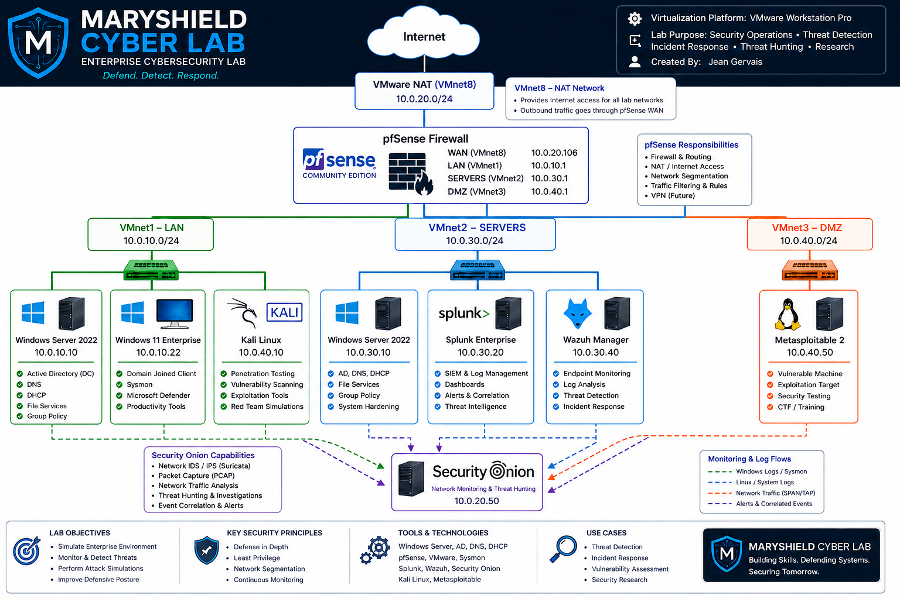

# MaryShield Cyber Lab

### Enterprise Cybersecurity Portfolio & SOC Analysis Environment

**Protect • Detect • Respond • Defend**

## Overview

MaryShield Cyber Lab is a multi-segment enterprise cybersecurity environment designed to demonstrate practical experience with security monitoring, threat detection, incident response, Active Directory security, endpoint telemetry, SIEM analysis, network security monitoring, threat hunting, and controlled security testing.

The lab combines Windows, Linux, networking, SIEM, XDR, IDS/NSM, firewall, endpoint-monitoring, and penetration-testing technologies to simulate realistic enterprise security operations.

The environment is used to generate, detect, investigate, correlate, contain, and document controlled cybersecurity events.

---

## Lab Objectives

The MaryShield Cyber Lab was designed to demonstrate practical experience in:

- Enterprise network architecture
- Security monitoring
- SOC operations
- SIEM administration
- Endpoint detection and response
- Active Directory security
- Windows Event Log analysis
- Microsoft Sysmon telemetry
- Threat hunting
- Incident response
- Network security monitoring
- Firewall administration
- Detection engineering
- MITRE ATT&CK mapping
- Vulnerability assessment
- Controlled penetration testing
- Security-event correlation
- Technical cybersecurity reporting

---

## Core Technologies

| Technology | Purpose |
|---|---|
| Windows Server 2022 | Active Directory, DNS, authentication, enterprise services |
| Active Directory | Identity and access management |
| Windows 11 | Domain-joined endpoint |
| Ubuntu Linux | Linux server infrastructure |
| Splunk Enterprise | SIEM, centralized logging, dashboards, searches, and correlation |
| Wazuh XDR | Endpoint monitoring, FIM, security analytics, and vulnerability visibility |
| Security Onion | Network security monitoring, IDS, Zeek, Suricata, and Hunt |
| pfSense | Firewall, routing, segmentation, logging, and containment |
| Microsoft Sysmon | Advanced Windows endpoint telemetry |
| Kali Linux | Authorized penetration-testing workstation |
| Metasploitable 2 | Intentionally vulnerable testing target |
| VMware Workstation Pro | Virtualization platform |
| Zeek | Network protocol metadata |
| Suricata | Network intrusion detection |

---

## Enterprise Lab Architecture

The environment is segmented into multiple logical security zones.

| Network | Purpose |
|---|---|
| LAN | User endpoints and management systems |
| Servers | Enterprise infrastructure and security servers |
| DMZ | Authorized offensive-security and vulnerable systems |
| WAN / NAT | External connectivity through pfSense |

Traffic between security zones is controlled through pfSense firewall policies and monitored by the deployed security platforms.

### Architecture Diagram



---

## SOC Operations Workflow

The lab supports an end-to-end security operations workflow:

```text
Security Activity
        ↓
Telemetry Collection
        ↓
SIEM / XDR / IDS Detection
        ↓
SOC Alert Triage
        ↓
Threat Hunting
        ↓
Cross-Platform Correlation
        ↓
MITRE ATT&CK Mapping
        ↓
Incident Response
        ↓
Containment
        ↓
Eradication
        ↓
Recovery
        ↓
Final Investigation Report
```

---

## Featured Cybersecurity Projects

### SOC Analyst Case Study

End-to-end SOC investigation demonstrating alert triage, SIEM analysis, endpoint investigation, network analysis, firewall review, cross-platform correlation, containment, recovery, and security reporting.

### Incident Response

Structured incident-response exercise covering detection, triage, evidence collection, containment, eradication, recovery, and lessons learned.

### Enterprise Threat Hunting

Proactive investigation using Splunk Enterprise, Wazuh XDR, Security Onion, pfSense, Windows Event Logs, Sysmon, Zeek, and Suricata.

### Kerberoasting Detection & Investigation

Detection and investigation of Kerberos service-ticket activity using Windows Security Event ID 4769 and centralized SOC telemetry.

### Active Directory Attack Detection & Investigation

Analysis of authentication failures, successful logons, account-management events, PowerShell activity, identity telemetry, and cross-platform security evidence.

### Microsoft Sysmon Endpoint Detection

Windows endpoint-monitoring project covering process creation, PowerShell activity, network connections, file events, registry events, SIEM integration, and SOC investigation.

### Brute-Force Attack Detection & Investigation

Detection and investigation of repeated authentication failures using Windows Security Event ID 4625, SIEM correlation, source-IP analysis, endpoint telemetry, and security-monitoring evidence.

### Splunk Enterprise

Centralized logging, dashboards, searches, security-event correlation, Windows Event Logs, and Sysmon ingestion.

### Wazuh XDR

Endpoint monitoring, file integrity monitoring, security analytics, agent management, and threat investigation.

### Security Onion

Network security monitoring using Suricata, Zeek, Alerts, Hunt, and packet-level analysis.

### pfSense Firewall

Enterprise firewall configuration, routing, network segmentation, logging, access control, and incident containment.

### Kali Linux

Authorized penetration-testing workstation used to generate controlled security telemetry.

### Metasploitable 2

Intentionally vulnerable system used for controlled vulnerability assessment and exploitation exercises.

---

## Cybersecurity Investigation Write-Ups

The portfolio includes analyst-focused write-ups documenting evidence, investigation methodology, findings, response actions, MITRE ATT&CK mappings, lessons learned, and security recommendations.

### Available Write-Ups

- [Kerberoasting Detection & Investigation](writeup-kerberoasting.html)
- [Incident Response Investigation](writeup-incident-response.html)
- [Enterprise Threat Hunting](writeup-threat-hunting.html)
- [Active Directory Attack Detection](writeup-active-directory-detection.html)
- [Microsoft Sysmon Endpoint Investigation](writeup-sysmon.html)
- [SOC Analyst Case Study](writeup-soc-case-study.html)
- [Brute-Force Attack Detection & Investigation](writeup-brute-force-detection.html)

---

## Security Telemetry

The lab collects and analyzes telemetry from multiple sources, including:

- Windows Security Event Logs
- Microsoft Sysmon
- Active Directory authentication events
- Kerberos events
- PowerShell activity
- Wazuh endpoint events
- Splunk indexed events
- Security Onion alerts
- Suricata IDS alerts
- Zeek network metadata
- pfSense firewall logs
- File Integrity Monitoring events
- Network connection telemetry

---

## MITRE ATT&CK

Observed behavior is mapped to MITRE ATT&CK tactics and techniques when supported by collected evidence.

Examples of investigation areas include:

- Execution
- Credential Access
- Discovery
- Privilege Escalation
- Persistence
- Lateral Movement
- Command and Control

MITRE ATT&CK mappings are used to provide standardized terminology for detection, investigation, and reporting.

---

## Skills Demonstrated

- SOC Alert Triage
- SIEM Analysis
- Splunk SPL
- Endpoint Investigation
- Windows Event Analysis
- Microsoft Sysmon
- Wazuh XDR
- Security Onion
- Zeek
- Suricata
- pfSense
- Active Directory Security
- Kerberos Analysis
- Threat Hunting
- Incident Response
- Detection Engineering
- Network Security Monitoring
- Firewall Analysis
- MITRE ATT&CK Mapping
- Vulnerability Assessment
- Security Event Correlation
- Timeline Reconstruction
- Technical Security Reporting

---

## Authorized Lab Testing

All attack simulations, vulnerability assessments, exploitation exercises, and security investigations documented in this repository were performed exclusively against systems owned and operated within the isolated MaryShield Cyber Lab.

The environment is designed for defensive cybersecurity education, SOC analysis, threat detection, incident response, detection engineering, and authorized security research.

No testing documented in this repository is intended for unauthorized systems or networks.

---

## Repository Navigation

| Resource | Description |
|---|---|
| `index.html` | Portfolio home page |
| `projects.html` | Cybersecurity project portfolio |
| `lab.html` | Enterprise cyber lab overview and architecture |
| `writeups.html` | Cybersecurity investigation write-ups |
| `resume.html` | Professional résumé |
| `certifications.html` | Certifications and professional development |
| `contact.html` | Contact information |
| `css/styles.css` | Website styling |
| `images/` | Architecture diagrams and project evidence |

---

## Portfolio Website

The complete interactive cybersecurity portfolio is available through the MaryShield Cyber Lab website.

**MaryShield Cyber Lab**

https://maryshieldcyberlab.github.io/maryshield-cyber-lab/

---

## Certifications & Professional Development

Cybersecurity certifications and continuing professional development support the technical work demonstrated throughout the lab.

### Earned Certifications

- ISC2 Certified in Cybersecurity (CC)
- CompTIA Network+

### Professional Development

Continuing study includes enterprise cybersecurity, security operations, threat detection, incident response, network security, identity and access management, and security engineering.

---

## Professional Cybersecurity Resume

View my professional cybersecurity resume highlighting my experience in cybersecurity, network engineering, security operations, enterprise technology, threat detection, incident response, and the MaryShield Cyber Lab.

[View Cybersecurity Resume](Jean_Gervais_ATS_Cybersecurity_Resume_Updated.pdf)

---

## Author

**Jean Gervais**

**MaryShield Cyber Lab**

Cybersecurity • SOC Operations • Threat Detection • Incident Response • Threat Hunting • Network Defense

**Protect • Detect • Respond • Defend**

---

© 2026 MaryShield Cyber Lab